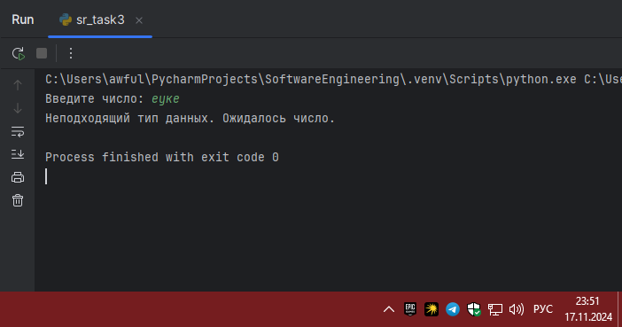

# Тема 10. Декораторы и исключения
Отчет по Теме #10 выполнил:
- Артемов Артём Вячеславович
- ИВТ-22-1

| Задание    | Лаб_раб | Сам_раб |
|------------|---------|---------|
| Задание 1  | +       | +       |
| Задание 2  | +       | +       |
| Задание 3  | +       | +       |
| Задание 4  | +       | +       |
| Задание 5  | +       | +       |
| Задание 6  | -       | -       |
| Задание 7  | -       | -       |
| Задание 8  | -       | -       |
| Задание 9  | -       | -       |
| Задание 10 | -       | -       |

знак "+" - задание выполнено; знак "-" - задание не выполнено;

Работу проверили:
- к.э.н., доцент Панов М.А.

## Лабораторная работа №1
### Наверняка вы думаете, что декораторы – это какая-то бесполезная
### вещь, которая вам никогда не пригодится, но тут вдруг на паре по
### математике преподаватель просит всех посчитать число Фибоначчи для
### 100. Кто-то будет считать вручную (так точно не нужно), кто-то
### посчитает на калькуляторе, а кто-то подумает, что он самый крутой и
### напишет рекурсивную программу на Python и немного огорчится,
### потому что данная программа будет достаточно долго считаться, если
### ее просто так запускать. Но именно тут к вам на помощь приходят
### декораторы, например @lru_cache (он предназначен для решения задач
### динамическим программированием, если простыми словами, то этот
### декоратор запоминает промежуточные результаты и при рекурсивном
### вызове функции программа не будет считать одни и те же значения, а
### просто “возьмёт их из этого декоратора”). Вам нужно написать
### программу, которая будет считать числа Фибоначчи для 100 и
### запустить ее без этого декоратора и с ним, посмотреть на разницу во
### времени решения поставленной задачи.
### P.S. при запуске без декоратора можете долго не ждать, для
### наглядности хватит 10 секунд ожидания.

```python
from functools import lru_cache


@lru_cache(None)
def fibonacci(n):
    if n == 0:
        return 0
    elif n == 1:
        return 1
    return fibonacci(n - 1) + fibonacci(n - 2)

print(fibonacci(100))
```
### Результат.


### Выводы

Продемонстрирована важность использования декораторов в Python

## Лабораторная работа №2
### Илья пишет свой сайт и ему необходимо сделать минимальную
### проверку ввода данных пользователя при регистрации. Для этого он
### реализовал функцию, которая выводит данные пользователя на экран и
### решил, что будет проверять правильность введённых данных при
### помощи декоратора, но в этом ему потребовалась ваша помощь.
### Напишите декоратор для функции, который будет принимать все
### параметры вызываемой функции (имя, возраст) и проверять чтобы
### возраст был больше 0 и меньше 130.
### Причем заметьте, что неважно сколько пользователь введет данных на
### сайт к Илье, будут обрабатываться только первые 2 аргумента.

```python
def check(input_func):
    def output_func(*args):
        name, age = args[0], args[1]

        if age < 0 or age > 130:
            age = 'Недопустимый возраст'
        input_func(name, age)

    return output_func


@check
def personal_info(name, age):
    print(f"Name: {name} Age: {age}")

personal_info('Владимир', 38)
personal_info('Александр', -5)
personal_info('Петр', 138, 15, 48, 2)
```
### Результат.


### Выводы

Разработан декоратор, который эффективно проверяет ввод данных пользователя при регистрации на сайте

## Лабораторная работа №3
### Вам понравилась идея Ильи с сайтом, и вы решили дальше работать
### вместе с ним. Но вот в вашем проекте появилась проблема, кто-то
### пытается сломать вашу функцию с получением данных для сайта. Эта
### функция работает только с данными integer, а какой-то недохакер
### пытается все сломать и вместо нужного типа данных отправляет string.
### Воспользуйтесь исключениями, чтобы неподходящий тип данных не
### ломал ваш сайт.
### Также дополнительно можете обернуть весь код функции в
### try/except/finally для того, чтобы программа вас оповестила о том, что
### выявлена какая-то ошибка или программа успешно выполнена.

```python
def data(*args):
    try:
        for i in range(len(*args)):
            try:
                result = (args[0][i] * 15) // 10
                print(result)
            except Exception as ex:
                print(ex)
    except Exception as ex:
        print(ex)
    finally:
        print('Вся информация обработана')

data([1, 15, 'Hello', 'i', 'try', 'to', 'crash', 'your', 'site', 38, 45])
```
### Результат.


### Выводы

Реализована система обработки исключений для функции, обрабатывающей данные на сайте
  
## Лабораторная работа №4
### Продолжая работу над сайтом, вы решили написать собственное
### исключение, которое будет вызываться в случае, если в функцию
### проверки имени при регистрации передана строка длиннее десяти
### символов, а если имя имеет допустимую длину, то в консоль
### выводиться “Успешная регистрация”

```python
class NegativeValueException(Exception):
    pass

def check_name(name):
    if len(name) > 10:
        raise NegativeValueException('Длина более 10 символов')
    else:
        print('Успешная регистрация')

name = '123456788910'
check_name(name)
```
### Результат.


### Выводы

Создано собственное исключение для проверки длины строки имени пользователя при регистрации

## Лабораторная работа №5
### После запуска сайта вы поняли, что вам необходимо добавить логгер,
### для отслеживания его работы. Готовыми вариантами вы не захотели
### пользоваться, и поэтому решили создать очень простую пародию. Для
### этого создали две функции: __init__() (вызывается при создании класса
### декоратора в программе) и __call__() (вызывается при вызове
### декоратора). Создайте необходимый вам декоратор. Выведите все логи
### в консоль.


```python
class SiteChecker:
    def __init__(self, func):
        print('> Класс SiteChecker метод __init__ успешный запуск')
        self.func = func

    def __call__(self):
        print('> Проверка перед запуском', self.func.__name__)
        self.func()
        print('> Проверка безопасного выключения')


@SiteChecker
def site():
    print('Усердная работа сайта')

print('>> Сайт запущен')
site()
print('>> Сайт выключен')
```
### Результат.


### Выводы

Разработан простой логгер для отслеживания работы сайта с использованием декоратора

## Самостоятельная работа №1
### Вовочка решил заняться спортивным программированием на python, но
### для этого он должен знать за какое время выполняется его программа.
### Он решил, что для этого ему идеально подойдет декоратор для
### функции, который будет выяснять за какое время выполняется та или
### иная функция. Помогите Вовочке в его начинаниях и напишите такой
### декоратор.
### Подсказка: необходимо использовать модуль time
### Декоратор необходимо использовать для этой функции:
### def fibonacci():                                      
###    fib1 = fib2 = 1
###    for i in range(2, 200):
###        fib1, fib2 = fib2, fib1 + fib2
### print(fib2, end=' ')
### if \_\_name__ == '\_\_main__':
###    fibonacci()
### Результатом вашей работы будет листинг кода и скриншот консоли, в
### котором будет выполненная функция Фибоначчи и время выполнения
### программы.
### Также на этом примере можете посмотреть, что решение задач через
### рекурсию не всегда является хорошей идеей. Поскольку решение
### Фибоначчи для 100 с использованием рекурсии и без динамического
### программирования решается более десяти секунд, а решение точно
### такой же задачи, но через цикл for еще и для 200, занимает меньше 1
### секунды.

```python
import time

def measure_time(func):
    def wrapper(*args, **kwargs):
        start_time = time.time()
        result = func(*args, **kwargs)
        end_time = time.time()
        print(f"Время выполнения функции: {end_time - start_time:.6f} секунд")
        return result
    return wrapper

@measure_time
def fibonacci():
    fib1 = fib2 = 1
    for i in range(2, 200):
        fib1, fib2 = fib2, fib1 + fib2
        print(fib2, end=' ')
    print()

fibonacci()
```
### Результат.


### Выводы

Реализован декоратор `measure_time`, который позволяет измерять время выполнения любой функции
  
## Самостоятельная работа №2
### Посмотрев на Вовочку, вы также загорелись идеей спортивного
### программирования, начав тренировки вы узнали, что для решения
### некоторых задач необходимо считывать данные из файлов. Но через
### некоторое время вы столкнулись с проблемой что файлы бывают
### пустыми, и вы не получаете вводные данные для решения задачи.
### После этого вы решили не просто считывать данные из файла, а всю
### конструкцию оборачивать в исключения, чтобы избежать такой    проблемы. Создайте пустой файл и файл, в котором есть какая-то
### информация. Напишите код программы. Если файл пустой, то, нужно
### вызвать исключение (“бросить исключение”) и вывести в консоль
### “файл пустой”, а если он не пустой, то вывести информацию из файла.

```python
def read_file(filename):
    try:
        with open(filename, 'r', encoding='utf-8') as file:
            content = file.read()
            if not content:
                raise ValueError("файл пустой")
            print("Содержимое файла:")
            print(content)
    except ValueError as e:
        print(e)
    except FileNotFoundError:
        print("Файл не найден")

read_file("empty.txt")
read_file("sr_task2.txt")
```

### Результат.


### Выводы

Разработана функция `read_file`, предназначенная для считывания данных из файлов. Реализован механизм обработки исключений, который позволяет обрабатывать два основных сценария: когда файл пустой и когда файл не найден
  
## Самостоятельная работа №3
### Напишите функцию, которая будет складывать 2 и введенное
### пользователем число, но если пользователь введет строку или другой
### неподходящий тип данных, то в консоль выведется ошибка
### “Неподходящий тип данных. Ожидалось число.”. Реализовать
### функционал программы необходимо через try/except и подобрать
### правильный тип исключения. Создавать собственное исключение
### нельзя. Проведите несколько тестов, в которых исключение вызывается
### и нет. Результатом выполнения задачи будет листинг кода и
### получившийся вывод в консоль


```python
def add_two_to_input():
    try:
        user_input = input("Введите число: ")
        number = float(user_input)
        result = 2 + number
        print(f"Результат сложения: {result}")
    except ValueError:
        print("Неподходящий тип данных. Ожидалось число.")

add_two_to_input()
```

### Результат.




### Выводы

Реализована функция `add_two_to_input`, которая складывает число 2 с введенным пользователем числом. Программа использует обработку исключений для проверки типа введенных данных

  
## Самостоятельная работа №4
### Создайте собственный декоратор, который будет использоваться для
### двух любых вами придуманных функций. Декораторы, которые
### использовались ранее в работе нельзя воссоздавать. Результатом
### выполнения задачи будет: класс декоратора, две как-то связанными с
### ним функциями, скриншот консоли с выполненной программой и
### подробные комментарии, которые будут описывать работу вашего
### кода.


```python
class RepeatDecorator:
    def __init__(self, times):
        # количество повторений функции
        self.times = times

    def __call__(self, func):
        # позволяет экземплярам класса использоваться как декораторы
        def wrapper(*args, **kwargs):
            # внутренняя функция, которая будет выполнять декорируемую функцию
            for i in range(self.times):
                # цикл для выполнения функции заданное количество раз
                print(f"Выполнение {i + 1} из {self.times}")
                func(*args, **kwargs)  # вызов декорируемой функции с аргументами
        return wrapper  # возвращаем обертку в качестве декорированной функции

# используем декоратор для функции print_hello
@RepeatDecorator(times=3)
def print_hello():
    # функция, которая печатает приветствие
    print("Привет!")

# переменная для счетчика
counter = 0

# используем декоратор для функции increment_counter
@RepeatDecorator(times=5)
def increment_counter():
    # функция, которая инкрементирует версию счетчика и выводит его значение
    global counter  # используем переменную счетчика
    counter += 1  # увеличиваем значение счетчика на 1
    print(f"Текущее значение счетчика: {counter}")

# запуск функции print_hello
print("Запуск функции print_hello:")
print_hello()

# запуск функции increment_counter
print("\nЗапуск функции increment_counter:")
increment_counter()
```

### Результат.


### Выводы

Реализован собственный декоратор `RepeatDecorator`, который позволяет вызывать заданную функцию несколько раз (количество задано при инициализации декоратора). Результат выполнения кода показывает, как декоратор оборачивает две функции — `print_hello` и `increment_counter`
  
## Самостоятельная работа №5
### Создайте собственное исключение, которое будет использоваться в
### двух любых фрагментах кода. Исключения, которые использовались
### ранее в работе нельзя воссоздавать. Результатом выполнения задачи
### будет: класс исключения, код к котором в двух местах используется это
### исключение, скриншот консоли с выполненной программой и
### подробные комментарии, которые будут описывать работу вашего
### кода.


```python
class NegativeNumberError(Exception):
    """
    класс для пользовательского исключения, которое будет
    выбрасываться при попытке работы с отрицательными числами
    """

    def __init__(self, message="Отрицательное число недопустимо"):
        """
        конструктор класса, инициализирует сообщение исключения

        :param message: сообщение об ошибке, если оно не указано, будет использоваться стандартное сообщение
        """
        super().__init__(message)  # вызов конструктора родительского класса Exception


import math  # импортируем модуль math для использования математических функций


def calculate_square_root(value):
    """
    функция для вычисления квадратного корня.

    :param value: число, из которого требуется извлечь квадратный корень
    :raises NegativeNumberError: если передано отрицательное число
    :return: квадратный корень числа
    """
    if value < 0:
        # если значение меньше нуля, выбрасываем пользовательское исключение
        raise NegativeNumberError("Ошибка: Нельзя вычислить квадратный корень из отрицательного числа.")

    return math.sqrt(value)  # возвращаем квадратный корень числа


def subtract(a, b):
    """
    функция для вычитания двух чисел

    :param a: уменьшаемое
    :param b: вычитаемое
    :raises NegativeNumberError: если результат вычитания меньше нуля
    :return: результат вычитания a - b
    """
    result = a - b  # вычисляем результат вычитания

    if result < 0:
        # если результат меньше нуля, выбрасываем пользовательское исключение
        raise NegativeNumberError("Ошибка: Результат вычитания не может быть отрицательным.")

    return result  # возвращаем результат вычитания


# блок для обработки возможных исключений при вычислении квадратного корня
try:
    print("Вычисление квадратного корня из 9:")
    print(calculate_square_root(9))  # ожидаем успешное выполнение

    print("\nВычисление квадратного корня из -4:")
    print(calculate_square_root(-4))  # здесь произойдет исключение

# обработка исключений
except NegativeNumberError as e:
    # если было выброшено исключение NegativeNumberError, выводим его сообщение
    print(e)

print("\n---\n")  # разделитель для читаемости вывода

# блок для обработки возможных исключений при вычитании
try:
    print("Вычитание 5 - 3:")
    print(subtract(5, 3))  # здесь мы ожидаем успешный результат

    print("\nВычитание 3 - 5:")
    print(subtract(3, 5))  # здесь произойдет исключение

# обработка исключений
except NegativeNumberError as e:
    # если было выброшено исключение NegativeNumberError, выводим его сообщение
    print(e)
```

### Результат.


### Выводы

Реализован собственный класс исключения `NegativeNumberError`, который будет использоваться для обработки ошибок, связанных с отрицательными числами. Исключение применяется в двух функциях: `calculate_square_root`, вычисляющей квадратный корень, и `subtract`, выполняющей вычитание двух чисел

## Общие выводы по теме

В ходе выполнения работ изучил исключения и декораторы в Python