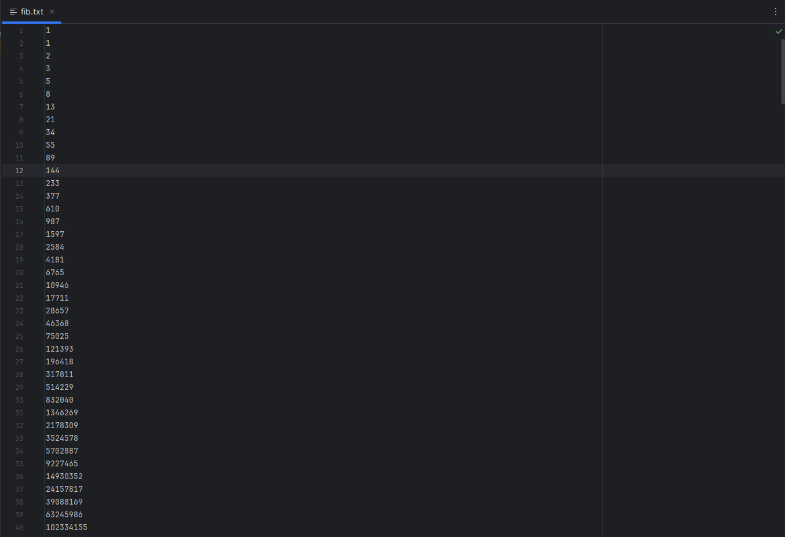

# Тема 11. Итераторы и генераторы
Отчет по Теме #11 выполнил:
- Артемов Артём Вячеславович
- ИВТ-22-1

| Задание    | Лаб_раб | Сам_раб |
|------------|---------|---------|
| Задание 1  | +       | +       |
| Задание 2  | +       | +       |
| Задание 3  | +       | -       |
| Задание 4  | +       | -       |
| Задание 5  | +       | -       |
| Задание 6  | -       | -       |
| Задание 7  | -       | -       |
| Задание 8  | -       | -       |
| Задание 9  | -       | -       |
| Задание 10 | -       | -       |

знак "+" - задание выполнено; знак "-" - задание не выполнено;

Работу проверили:
- к.э.н., доцент Панов М.А.

## Лабораторная работа №1
### Простой итератор, но у него нет гибкой настройки, например его
### нельзя развернуть. Он работает просто как next(), но нет prev()

```python
numbers = [0, 1, 2, 3, 4, 5]
for item in numbers:
    print(item)
```
### Результат.


### Выводы

Простой итератор, основанный на списке `numbers`, который содержит значения от 0 до 5

## Лабораторная работа №2
### Класс итератор с гибкой настройкой и удобными применением

```python
class CountDown:
    def __init__(self, start):
        self.count = start + 1

    def __iter__(self):
        return self

    def __next__(self):
        self.count -= 1
        if self.count < 0:
            raise StopIteration
        return self.count

counter = CountDown(5)
for i in counter:
    print(i)
```
### Результат.


### Выводы

Разработан класс-итератор `CountDown`, который реализует функциональность обратного отсчета

## Лабораторная работа №3
### Генератор списка

```python
a = [i ** 2 for i in range(1, 5)]

print('a - ', a)
for i in a:
    print(i)

print('iter(a) - ', iter(a))
for i in a:
    print(i)
```
### Результат.


### Выводы

Создан список `a`, состоящий из квадратов чисел от 1 до 4, с использованием генератора списка
  
## Лабораторная работа №4
### Выражения генераторы

```python
b = (i ** 2 for i in range(1, 5))
print(b)
print('first')
for i in b:
    print(i)
print('second')

for i in b:
    print(i)
```
### Результат.


### Выводы

генератор

## Лабораторная работа №5
### Такой же счетчик, как и в первом задании, только это генератор и
### использует yield

```python
def countdown(count):
    while count >= 0:
        yield count
        count -= 1

counter = countdown(5)
for i in counter:
    print(i)
```
### Результат.


### Выводы

Создание генератора обратного отсчета с использованием ключевого слова `yield`

## Самостоятельная работа №1
### Вас никак не могут оставить числа Фибоначчи, очень уж они вас заинтересовали. Изучив новые возможности Python вы решили реализовать программу, которая считает числа Фибоначчи при помощи итераторов. Расчет начинается с чисел 1 и 1. Создайте функцию fib(n), генерирующую n чисел Фибоначчи с минимальными затратами ресурсов. Для реализации этой функции потребуется обратиться к инструкции yield (Она не сохраняет в оперативной памяти огромную последовательность, а дает возможность “доставать” промежуточные результаты по одному). Результатом решения задачи будет листинг кода и вывод в консоль с числом Фибоначчи от 200

```python
def fib(n):
    a, b = 1, 1
    for num in range(n):
        yield a
        a, b = b, a + b

n = 300
fibonacci_numbers = list(fib(n))

print(f"{n}-е число Фибоначчи: {fibonacci_numbers[-1]}")
```
### Результат.


### Выводы

Была реализована функция `fib(n)`, которая генерирует первые n чисел Фибоначчи с помощью итераторов и ключевого слова `yield`. Начальные значения последовательности Фибоначчи установлены как 1 и 1, что соответствует определению чисел Фибоначчи
  
## Самостоятельная работа №2
### К коду предыдущей задачи добавьте запоминание каждого числа Фибоначчи в файл “fib.txt”, при этом каждое число должно находиться на отдельной строчке. Результатом выполнения задачи будет листинг кода и скриншот получившегося файла

```python
def fib(n):
    a, b = 1, 1
    with open('fib.txt', 'w') as f:
        for _ in range(n):
            f.write(f"{a}\n")
            yield a
            a, b = b, a + b

n = 300
fibonacci_numbers = list(fib(n))

print(f"{n}-е число Фибоначчи: {fibonacci_numbers[-1]}")
```
### Результат.




### Выводы

Расширена функция `fib(n)`, чтобы она не только генерировала числа Фибоначчи, но и записывала их в файл `fib.txt`, при этом каждое число размещалось на отдельной строке

## Общие выводы по теме

Изучена и применена концепция итераторов и генераторов в Python