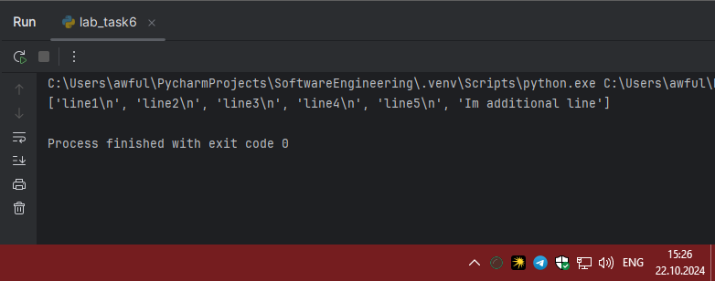
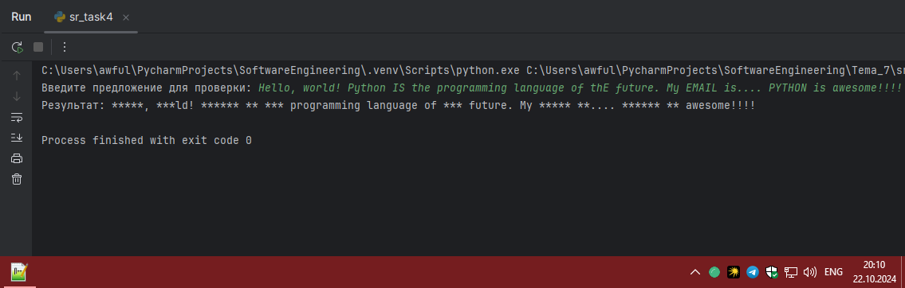

# Тема 2. Базовые операции языка Python
Отчет по Теме #2 выполнил(а):
- Артемов Артём Вячеславович
- ИВТ-22-1

| Задание | Лаб_раб | Сам_раб |
| ------ | ------ | ------ |
| Задание 1 | + | + |
| Задание 2 | + | + |
| Задание 3 | + | + |
| Задание 4 | + | + |
| Задание 5 | + | + |
| Задание 6 | + | + |
| Задание 7 | + | + |
| Задание 8 | + | + |
| Задание 9 | + | + |
| Задание 10 | + | + |

знак "+" - задание выполнено; знак "-" - задание не выполнено;

Работу проверили:
- к.э.н., доцент Панов М.А.

## Лабораторная работа №1
### Выведите в консоль три строки. Первая – любое число. Вторая – любое число в виде строки. Третья – любое число с плавающей точкой.

```python
print(999)
print("999")
print(99.9)
```
### Результат.


## Лабораторная работа №2
### Выведите в консоль три строки. Первая – результат сложения или вычитания минимум двух переменных типа int. Вторая – результат сложения или вычитания минимум двух переменных типа float. Третья – результат сложения или вычитания минимум двух переменных типа int и float.

```python
print(99-9)
print(99.9+10.6)
print(90+12.3)
```
### Результат.


## Лабораторная работа №3
### Выведите в консоль три строки. Первая – обычная строка. Вторая – F строка с использованием заранее объявленной переменной. Третья – сложите две или более строк в одну.

```python
print("abc")

num = 3
print(f"Task num: {num}")

first = "Task num"
second = ": 3"
print(first + second)
```
### Результат.


## Лабораторная работа №4
### Выведите в консоль три строки. Первая – трансформация любого типа переменной в bool. Вторая – трансформация любого типа переменной в float или int. Третья – трансформация Панов любого типа переменной в str.

```python
num = 1.6

print(bool(num))
print(int(num))
print(str(num))
```
### Результат.


## Лабораторная работа №5
### Присвойте трем переменным различные значения, воспользовавшись функцией input()

```python
one = str(input("Введите символ: "))
two = int(input("Введите целое число: "))
three = float(input("Введите дробное число: "))
print(one, two, three, sep="\n")
```
### Результат.


## Лабораторная работа №6
### Создайте две любые числовые переменные и выполните над ними несколько математических операций: возведение в степень, обычное деление, целочисленное деление, нахождение остатка от деления. При желании вы можете проверить как работают эти вычисления с разными типами данных, например, сначала создать две переменные int, затем создать две переменные float и наконец создать переменные типа int и float и провести над ними Панов операции, прописанные выше.

```python
num1 = 9
num2 = 6

print("Num1 в 3ей степени: ", num1**3)
print("Num1 / Num2: ", num1/num2)
print("Num1 / Num2 без остатка: ", num1//num2)
print("Остаток от деления Num1 / Num2: ", num1%num2)
```
### Результат.



## Лабораторная работа №7
### Создайте любую строковую переменную и произведите над ней математическое действие умножение на любое число.

```python
x = "abc"
print(x*3)
```
### Результат.


## Лабораторная работа №8
### Посчитайте сколько раз символ ‘o’ встречается в строке ‘Hello World’.

```python
x = "Hello World!"
print(x.count('o'))
```
### Результат.


## Лабораторная работа №9
### Напишите предложение ‘Hello World’ в две строки. Написанная программа должна занимать одну строку в редакторе кода.

```python
print("Hello \nWorld")
```
### Результат.


## Лабораторная работа №10
### Из предложения ‘Hello World’ выведите в консоль только 2 символ, а затем выведите слово ‘Hello’

```python
x = "Hello World"

print(x[1:1:1])
print(x[0:5:1])
```
### Результат.


## Самостоятельная работа №1
### Выведите в консоль булевую переменную False, не используя слово False в строке или изначально присвоенную булевую переменную. Программа должна занимать не более двух строк редактора кода.

```python
x = None
print(bool(x))
```
### Результат.


### Выводы

`print(bool(x))` конвертируем в bool - None при переводе в bool даёт False
  
## Самостоятельная работа №2
### Присвоить значения трем переменным и вывести их в консоль, используя только две строки редактора кода

```python
a, b, c = 1, 2, 3
print(a, b, c)
```
### Результат.


### Выводы

В языке Python можно присваивать переменные таким образом
  
## Самостоятельная работа №3
### Реализуйте ввод данных в программу, через консоль, в виде только целых чисел (тип данных int). То есть при вводе буквенных символов в консоль, программа не должна работать. Программа должна занимать не более двух строк редактора кода.

```python
x = int(input("Введите целое число: "))
print(x)
```
### Результат.


### Выводы

При помощи `int` ограничиваем область допустим значений для ввода
  
## Самостоятельная работа №4
### Создайте только одну строковую переменную. Длина строки должна не превышать 5 символов. На выходе мы должны получить строку длиной не менее 16 символов. Программа должна занимать не более двух строк редактора кода.

```python
x = "12345"
print(x*4)
```
### Результат.



### Выводы

`print(x*4)` если мы выведем строку "12345" 4 раза ее длина будет = 20
  
## Самостоятельная работа №5
### Создайте три переменные: день (тип данных - числовой), месяц (тип данных - строка), год (тип данных - числовой) и выведите в консоль текущую дату в формате: “Сегодня день месяц год. Всего хорошего!” используя F строку и оператор end внутри print(), в котором вы должны написать фразу “Всего хорошего!”. Программа должна занимать не более двух строк редактора кода.

```python
day = int(17); month = str("Сентября"); year = int(2024)
print(f"Сегодня {day} {month} {year}.", end=" Всего хорошего!")
```
### Результат.


### Выводы

Используя F строку и оператор end, корректно вывели информацию в консоль
  
## Самостоятельная работа №6
### В предложении ‘Hello World’ вставьте ‘my’ между двумя словами. Выведите полученное предложение в консоль в одну строку. Программа должна занимать не более двух строк редактора кода.

```python
x = "Hello World"
print(f"{x[:5]} My {x[6:]}")
```
### Результат.


### Выводы

Чтобы получить hello выводим первые 5 символов, выводим "My", а затем последние 5 символов: `print(f"{x[:5]} My {x[6:]}")`
  
## Самостоятельная работа №7
### Узнайте длину предложения ‘Hello World’, результат выведите в консоль. Программа должна занимать не более двух строк редактора кода.

```python
x = "Hello World"
print("Длина выражения: ", len(x))
```
### Результат.


### Выводы

При помощи функции len узнаем длину строки
  
## Самостоятельная работа №8
### Переведите предложение ‘HELLO WORLD’ в нижний регистр. Программа должна занимать не более двух строк редактора кода.

```python
x = "HELLO WORLD"
print(x.lower())
```
### Результат.


### Выводы

С помощью `lower` перевели строку в нижний регистр
  
## Самостоятельная работа №9
### Самостоятельно придумайте задачу по проходимой теме и решите ее. Задача должна быть связанна со взаимодействием с числовыми значениями.

Реализовать ввод данных в программу через консоль в виде трех целых чисел. Необходимо найти наибольшее и наименьшее из них.

```python
a = int(input("Введите первое целое число: "))
b = int(input("Введите второе целое число: "))
c = int(input("Введите третье целое число: "))

print(f"Наибольшее число: {max(a,b,c)} \nНаименьшее число: {min(a,b,c)}")
```
### Результат.


### Выводы

Используем `max` и `min` для нахождения наибольшего и наименьшего чисел
  
## Самостоятельная работа №10
### Самостоятельно придумайте задачу по проходимой теме и решите ее. Задача должна быть связанна со взаимодействием со строковыми значениями.

Дана строка, содержащая различные символы. Необходимо подсчитать, сколько раз в этой строке встречается буква 'a' (в верхнем и нижнем регистре).

```python
x = "Hello, World! I like Apples and Bananas."
print(f"Количество букв 'a': {x.lower().count("a")}")
```
### Результат.


### Выводы

Переводим строку в нижний регистр с помощью `lower`, затем подсчитываем количество символов `count("a")`

## Общие выводы по теме

Выполнение этой работы помогло мне укрепить фундаментальные навыки программирования на Python, включая работу со строками, числами и условными операторами