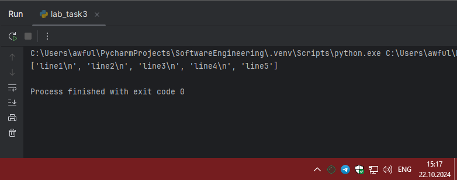
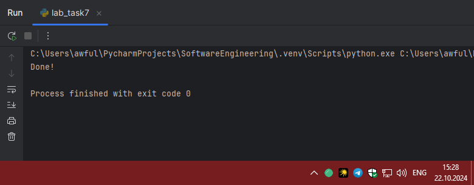
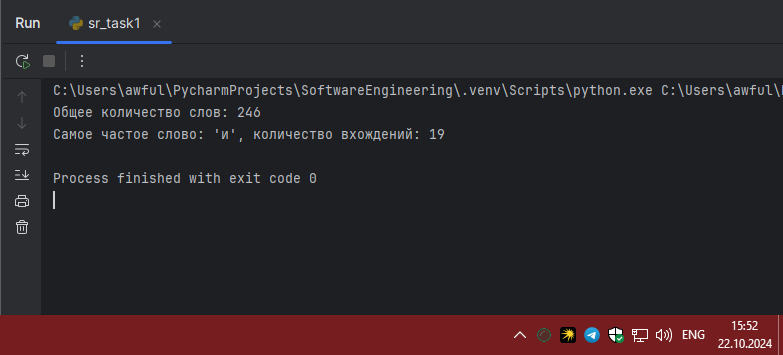
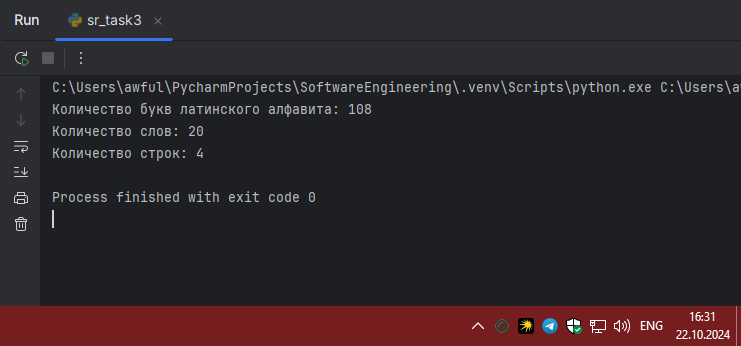

# Тема 3. Операторы, условия, циклы
Отчет по Теме #3 выполнил(а):
- Артемов Артём Вячеславович
- ИВТ-22-1

| Задание | Лаб_раб | Сам_раб |
| ------ | ------ | ------ |
| Задание 1 | + | + |
| Задание 2 | + | + |
| Задание 3 | + | + |
| Задание 4 | + | + |
| Задание 5 | + | + |
| Задание 6 | + | - |
| Задание 7 | + | - |
| Задание 8 | + | - |
| Задание 9 | + | - |
| Задание 10 | + | - |

знак "+" - задание выполнено; знак "-" - задание не выполнено;

Работу проверили:
- к.э.н., доцент Панов М.А.

## Лабораторная работа №1
### Создайте две переменные, значение которых будете вводить через консоль. Также составьте условие, в котором созданные ранее переменные будут сравниваться, если условие выполняется, то выведете в консоль «Выполняется», если нет, то «Не выполняется».

```python
a = int(input("1st num: "))
b = int(input("2nd num: "))

if a == b:
    print("Выполняется")
else:
    print("Не выполняется")
```
### Результат.


## Лабораторная работа №2
### Напишите программу, которая будет определять значения переменной меньше 0, больше 0 и меньше 10 или больше 10. Это нужно реализовать при помощи одной переменной, значение которой будет вводится через консоль, а также при помощи конструкций if, elif, else.

```python
a = int(input("num: "))
if a < 0:
    print("< 0")
elif 0 < a < 10:
    print("> 0 & < 10")
else:
    print("> 10")
```
### Результат.


## Лабораторная работа №3
### Напишите программу, в которой будет проверяться есть ли переменная в указанном массиве используя логический оператор in. Самостоятельно посмотрите, как работает программа со значениями которых нет в массиве numbers.

```python
numbers = [1, 5, 10, 15, 20, 111]
x = int(input("num: "))

if x in numbers:
    print("в массиве")
else:
    print("не в массиве")
```
### Результат.



## Лабораторная работа №4
### Напишите программу, которая будет определять находится ли переменная в указанном массиве и если да, то проверьте четная она или нет. Самостоятельно протестируйте данную программу с разными значениями переменной value.

```python
numbers = [5, 10, 15, 20, 25, 100, 111]
x = int(input("num: "))
if x in numbers:
    if x % 2 == 0:
        print("в массиве, четное")
    else:
        print("в массиве, нечетное")
else:
    print(f"переменной {x} нет в массиве")
```
### Результат.


## Лабораторная работа №5
### Напишите программу, в которой циклом for значения переменной i будут меняться от 0 до 10 и посмотрите, как разные виды сравнений и операций работают в цикле.

```python
for i in range(10):
    print("i = ", i)
    if i == 0:
        i += 2
    if i == 1:
        continue
    if i == 2 or i == 3:
        print("переменная равна 2 или 3")
    elif i in [4, 5, 6]:
        print("переменная равна 4, 5 или 6")
    else:
        break
```
### Результат.


## Лабораторная работа №6
### Напишите программу, в которой при помощи цикла for определяется есть ли переменная value в строке string и посмотрите, как работает оператор else для циклов. Самостоятельно посмотрите, что выведет программа, если значение переменной value оказалось в строке string. Определять индекс буквы не обязательно, но если вы хотите, то это делается при помощи строки: index = string.find(value) Вы берете название переменной, в которой вы хотите что-то найти, затем применяете встроенный метод find() и в нем указываете то, что вам нужно найти. Данная строка вернет индекс искомого объекта.

```python
string = "a b c d e f g f k"
value = input("буква: ")
for i in string:
    if i == value:
        index = string.find(value)
        print(f"буква  {value}  есть в строке под индексом {index}")
        break
else:
    print(f"буквы {value} нет в строке")
```
### Результат.


## Лабораторная работа №7
### Напишите программу, в которой вы наглядно посмотрите, как работает цикл for проходя в обратном порядке, то есть, к примеру не от 0 до 10, а от 10 до 0. В уже готовой программе показано вычитание из 100, а вам во время реализации программы будет необходимо придумать свой вариант применения обратного цикла.

```python
x = 2
for i in range(10, -1, -1):
    print(i, " - ", x)
    x = x**2

```
### Результат.



## Лабораторная работа №8
### Напишите программу используя цикл while, внутри которого есть какие-либо проверки, но быть осторожным, поскольку циклы while при неправильно написанных условиях могут становится бесконечными, как указано в примере далее.

```python
x = 0
while x < 100:
    print(x)
    if x % 10 == 0:
        x += 15
    elif x % 2 == 0:
        x += 1
    else:
        x += 2
```
### Результат.


## Лабораторная работа №9
### Напишите программу с использованием вложенных циклов и одной проверкой внутри них. Самое главное, не забудьте, что нельзя использовать одинаковые имена итерируемых переменных, когда вы используете вложенные циклы.

```python
value = 0
for i in range(10):
    for j in range(10):
        if i != j:
            value += j
        else:
            pass

print(value)
```
### Результат.


## Лабораторная работа №10
### Напишите программу с использованием flag, которое будет определять есть ли нечетное число в массиве. В данной задаче flag выступает в роли индикатора встречи нечетного числа в исходном массиве, четных чисел.

```python
array = [2, 4, 6, 8, 9]
flag = False
for value in array:
    if value % 2 == 1:
        flag = True

if flag is True:
    print("в массиве есть нечет число")
else:
    print("все числа четные")
```
### Результат.


## Самостоятельная работа №1
### Задания для самостоятельного выполнения: 1) Напишите программу, которая преобразует 1 в 31.
### Для выполнения поставленной задачи необходимо обязательно и
### только один раз использовать:
### • Цикл for
### • *= 5
### • += 1
### Никаких других действий или циклов использовать нельзя.

```python
x = 1
for i in range(2):
    x *= 5
    x += 1
print(x)
```
### Результат.



### Выводы

`range(2):` - 2 прохода цикла
  
## Самостоятельная работа №2
### Напишите программу, которая фразу «Hello World» выводит в
### обратном порядке, и каждая буква находится в одной строке консоли.
### Пример вывода в консоль:
### При этом необходимо обязательно использовать любой цикл, а также
### программа должна занимать не более 3 строк в редакторе кода.

```python
string = "Hello, World!"
for i in range(len(string) - 1, -1, -1):
    print(string[i])
```
### Результат.


### Выводы

`for i in range(len(string) - 1, -1, -1):` - обратный цикл
  
## Самостоятельная работа №3
### Напишите программу, на вход которой поступает значение из консоли, оно должно быть числовым и в диапазоне от 0 до 10 включительно (это
### необходимо учесть в программе). Если вводимое число не подходит по
### требованиям, то необходимо вывести оповещение об этом в консоль и
### остановить программу. Код должен вычислять в каком диапазоне
### находится полученное число. Нужно учитывать три диапазона:
### • от 0 до 3 включительно
### • от 3 до 6
### • от 6 до 10 включительно
### Результатом работы программы будет выведенный в консоль диапазон.
### Программа должна занимать не более 10 строчек в редакторе кода.

```python
x = int(input("число:"))
if x<0 or x>10:
    print(f"Число {x} вне диапазона")
elif x<=3 and x>=0:
    print("Число в диапазоне 0-3")
elif x>3 and x<6:
    print("Число в дапазоне 3-6")
elif x>=6 and x<=10:
    print("Число в диапазоне 6-10")
```
### Результат.



### Выводы

При помощи конструкции `if-elif-else` определяем диапазон, в котором находится число
  
## Самостоятельная работа №4
### Манипулирование строками. Напишите программу на Python, которая
### принимает предложение (на английском) в качестве входных данных
### от пользователя. Выполните следующие операции и отобразите
### результаты:
### • Выведите длину предложения.
### • Переведите предложение в нижний регистр.
### • Подсчитайте количество гласных (a, e, i, o, u) в предложении.
### • Замените все слова "ugly" на "beauty".
### • Проверьте, начинается ли предложение с "The" и заканчивается
### ли на "end".
### Проверьте работу программы минимум на 3 предложениях, чтобы
### охватить проверку всех поставленных условий.

```python
text = input("текст: ")
print(f"длина: {len(text)}")
lower_text = text.lower()
print(f"в ниж рег: {lower_text}")
count = 0
vow = "aeiou"
for vow in lower_text:
    if vow in vow:
        count += 1
print("кол-во гласных: ", count)
print("замена: ", lower_text.replace("ugly", "beauty"))
print("'The': ", text.startswith("The"))
print("'End': ", text.endswith("end"))

```
### Результат.


### Выводы

Этот код обрабатывает предложение, введенное пользователем на английском языке. Выводится длина предложения, происходит его перевод в нижний регистр, подсчитывается количество гласных, "ugly" заменяется на "beauty", проверка начинается ли предложение с "The" и заканчивается ли на "end"
  
## Самостоятельная работа №5
### Составьте программу, результатом которой будет данный вывод в
### консоль:
### Программу нужно составить из данных фрагментов кода:
### Строки кода можно использовать только один раз.
### Не обязательно использовать все строки кода.

```python
string = 'hello'
memory = ' world'
counter = 0
while counter != 10:
    print(string + memory)
    print(string)
    counter += 1
string = string + ' world'
memory = string
print(memory)
```
### Результат.


### Выводы

Программа демонстрирует использование основных управляющих конструкций, таких как циклы и условные операторы, для вывода заданной последовательности строк из слов "hello" и "world"

## Общие выводы по теме

Использование операторов, условных конструкций и циклов в Python позволяет создавать эффективные и гибкие решения для самых разнообразных задач - от вычислений до обработки текста. Продемонстрированные примеры подчеркивают, что Python как язык программирования отличается широкими возможностями и удобством при реализации разнообразных алгоритмов