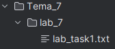
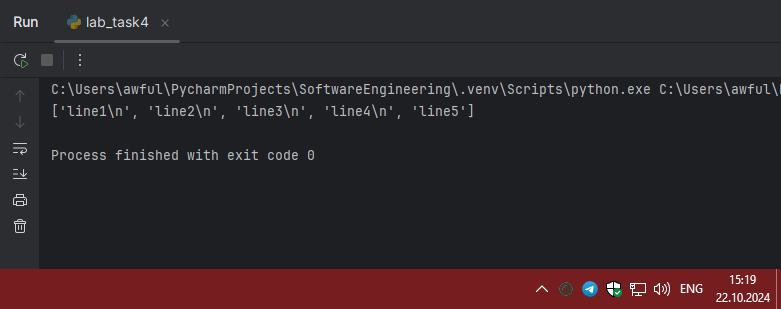
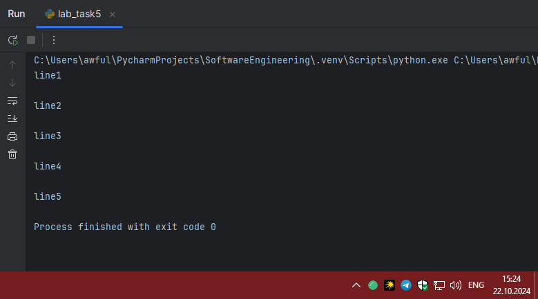

# Тема 4. Функции и стандартные модули/библиотеки
Отчет по Теме #4 выполнил(а):
- Артемов Артём Вячеславович
- ИВТ-22-1

| Задание | Лаб_раб | Сам_раб |
| ------ | ------ | ------ |
| Задание 1 | + | + |
| Задание 2 | + | + |
| Задание 3 | + | + |
| Задание 4 | + | + |
| Задание 5 | + | + |
| Задание 6 | + | - |
| Задание 7 | + | - |
| Задание 8 | + | - |
| Задание 9 | + | - |
| Задание 10 | + | - |

знак "+" - задание выполнено; знак "-" - задание не выполнено;

Работу проверили:
- к.э.н., доцент Панов М.А.

## Лабораторная работа №1
### Напишите функцию, которая выполняет любые арифметические
### действия и выводит результат в консоль. Вызовите функцию используя
### “точку входа”.

```python
def main():
    print(2 + 2 * 2)


if __name__ == '__main__':
    main()
```
### Результат.



### Выводы

Данная задача предназначена для демонстрации использования функций и управления потоком выполнения программы через "точку входа"

## Лабораторная работа №2
### Напишите функцию, которая выполняет любые арифметические
### действия, возвращает при помощи return значение в место, откуда
### вызывали функцию. Выведите результат в консоль. Вызовите функцию
### используя “точку входа”.

```python
def main():
    result = 2 + 2 * 2
    print(result)
    return result

if __name__ == '__main__':
    main()
```
### Результат.


### Выводы

Функция успешно выполняет арифметические действия и возвращает результат. Результат выведен в консоль.

## Лабораторная работа №3
### Напишите функцию, в которую передаются два аргумента, над ними
### производится арифметическое действие, результат возвращается туда, откуда эту функцию вызывали. Выведите результат в консоль.
### Вызовите функцию в любом небольшом цикле.

```python
def main(one, two):
    result = one + two
    return result

for i in range(5):
    x = 1
    y = 10
    print(main(x,y))
```
### Результат.


### Выводы

Функция успешно выполняет арифметические действия над двумя аргументами и возвращает результат. Результат выводится в консоль в цикле.

## Лабораторная работа №4
### Напишите функцию, на вход которой подается какое-то изначальное
### неизвестное количество аргументов, над которыми будет производится
### арифметические действия. Для выполнения задания необходимо
### использовать кортеж “*args”. На скриншоте ниже приведен пример
### такой программы с комментариями.
### Для закрепления понимания работы с кортежами настоятельно
### рекомендуем поменять аргументы вызова функции, вручную посчитать
### результат, только потом запустить программу с новыми значениями и
### проверить себя, насколько вы поняли данный аспект
### программирования.

```python
def main(x, *args):
    one = x
    two = sum(args)
    three = float(len(args))
    print(f"one={one}\ntwo={two}\nthree={three}")

    return x + sum(args) / float(len(args))

if __name__ == '__main__':
    result = main(10, 0, 1, 2, -1, 0, -1, 1, 2)
    print(f"\nresult={result}")
```
### Результат.



### Выводы

Функция успешно выполняет арифметические действия над произвольным количеством аргументов, используя кортеж `*args`. Результат выводится в консоль.

## Лабораторная работа №5
### Напишите функцию, которая на вход получает кортеж “**kwargs” и
### при помощи цикла выводит значения, поступившие в функцию. На
### скриншоте ниже указаны два варианта вызова функции с “**kwargs” и
### два варианта работы с данными, поступившими в эту функцию.
### Комментарии в коде и теоретическая часть помогут вам разобраться в
### этом нелегком аспекте. Вызовите функцию используя “точку входа”.

```python
def main(**kwargs):
    for i in kwargs.items():
        print(i[0], i[1])

    print()

    for key in kwargs:
        print(f"{key} = {kwargs[key]}")

if __name__ == '__main__':
    main(x=[1, 2, 3], y=[3, 3, 0], z=[2, 3, 0], q=[3, 3, 0], w=[3, 3, 0])
    print()

    main(**{'x': [1, 2, 3], 'y': [3, 3, 0]})
```
### Результат.



### Выводы

Функция успешно принимает произвольный набор именованных аргументов (kwargs) и выводит их в консоль.

## Лабораторная работа №6
### Напишите две функции. Первая – получает в виде параметра
### “**kwargs”. Вторая считает среднее арифметическое из значений
### первой функции. Вызовите первую функцию используя “точку входа”
### и минимум 4 аргумента.

```python
def main(**kwargs):
    for i, j in kwargs.items():
        print(f"{i}. Mean = {mean(j)}")


def mean(data):
    return sum(data) / float(len(data))


if __name__ == '__main__':
    main(x=[1, 2, 3], y=[3, 3, 0])
```
### Результат.


### Выводы

Функция `main` принимает произвольный набор именованных аргументов `**kwargs`. В данном примере функция `main` вызывается с четырьмя ключами `x`, `y`, `z` и `w`, каждый из которых соответствует списку чисел.

## Лабораторная работа №7
### Создайте дополнительный файл .py. Напишите в нем любую функцию, которая будет что угодно выводить в консоль, но не вызывайте ее в
### нем. Откройте файл main.py, импортируйте в него функцию из нового
### файла и при помощи “точки входа” вызовите эту функцию.

```python
def helloworld():
    print('Hello, World!')

```

```python
from lab_task7 import helloworld

if __name__ == '__main__':
    helloworld()

```
### Результат.


### Выводы

 Создан дополнительный файл с расширением .py, в котором определена функция, выводящая "Hello, World!" в консоль.
 
## Лабораторная работа №8
### Напишите программу, которая будет выводить корень, синус, косинус
### полученного от пользователя числа.

```python
import math

def main():
    value = int(input('Введите значение: '))
    print(math.sqrt(value))
    print(math.sin(value))
    print(math.cos(value))

if __name__ == '__main__':
    main()
```
### Результат.


### Выводы

Результаты вычислений успешно получены и выведены.

## Лабораторная работа №9
### Напишите программу, которая будет рассчитывать какой день недели
### будет через n-нное количество дней, которые укажет пользователь.
### В результате день недели указан в виде цифры, где 1 = понедельник, 2
### = вторник, 3 = среда и так далее.

```python
from datetime import datetime as dt
from datetime import timedelta as td

def main():
    print(
        f"Сегодня {dt.today().date()}. "
        f"День недели - {dt.today().isoweekday()}"
    )
    n = int(input('Введите количество дней: '))
    today = dt.today()
    result = today + td(days=n)
    print(
        f"Через {n} дней будет {result.date()}. "
        f"День недели - {result.isoweekday()}"
    )

if __name__ == '__main__':
    main()
```
### Результат.


### Выводы

Программа успешно определяет день недели через заданное количество дней.

## Лабораторная работа №10
### Напишите программу с использованием глобальных переменных, которая будет считать площадь треугольника или прямоугольника в
### зависимости от того, что выберет пользователь. Получение всей
### необходимой информации реализовать через input(), а подсчет
### площадей выполнить при помощи функций. Результатом программы
### будет число, равное площади, необходимой фигуры.

```python
global result

def rectangle():
    a = float(input("Ширина: "))
    b = float(input("Высота: "))
    global result
    result = a * b

def triangle():
    a = float(input("Основание: "))
    h = float(input("Высота: "))
    global result
    result = 0.5 * a * h

figure = input("1-прямоугольник, 2-треугольник: ")

if figure == '1':
    rectangle()
elif figure == '2':
    triangle()

print(f"Площадь: {result}")
```
### Результат.


### Выводы

Программа успешно вычисляет площадь треугольника или прямоугольника по выбору пользователя.


## Самостоятельная работа №1
### Дайте подробный комментарий для кода, написанного ниже.
### Комментарий нужен для каждой строчки кода, нужно описать что она
### делает. Не забудь те, что функции комментируются по-особенному.

```python
from datetime import datetime
from math import sqrt

def main(**kwargs):
    for key in kwargs.items():
        result = sqrt(key[1][0] ** 2 + key[1][1] ** 2)
        print(result)

if __name__ == '__main__':
    start_time = datetime.now()
    main(
        one=[10, 3],
        two=[5, 4],
        three=[15, 13],
        four=[93, 53],
        five=[133, 15]
    )
    time_costs = datetime.now() - start_time
    print(f"Время выполнения программы - {time_costs}")
```
### Результат.


### Выводы

Предоставлены подробные комментарии для каждой строчки кода
  
## Самостоятельная работа №2
### Напишите программу, которая будет заменять игральную кость с 6
### гранями. Если значение равно 5 или 6, то в консоль выводится «Вы
### победили», если значения 3 или 4, то вы рекурсивно должны вызвать
### эту же функцию, если значение 1 или 2, то в консоль выводится «Вы
### проиграли». При этом каждый вызов функции необходимо выводить в
### консоль значение “кубика”. Для выполнения задания необходимо
### использовать стандартную библиотеку random. Программу нужно
### написать, используя одну функцию и “точку входа”

```python
from random import randint

def dice():
    number = randint(1, 6)

    print(f"Значение кубика: {number}")

    if number == 5 or number == 6:
        print("Вы победили")
    elif number == 3 or number == 4:
        dice()
    elif number == 1 or number == 2:
        print("Вы проиграли")

if __name__ == '__main__':
    dice()
```
### Результат.


### Выводы

Программа моделирует бросок игральной кости с 6 гранями.
  
## Самостоятельная работа №3
### Напишите программу, которая будет выводить текущее время, с
### точностью до секунд на протяжении 5 секунд. Программу нужно
### написать с использованием цикла. Подсказка: необходимо
### использовать модуль datetime и time, а также вам необходимо как-то
### “усыплять” программу на 1 секунду.

```python
import time
from datetime import datetime

duration = 5

for i in range(duration):
    current_time = datetime.now()
    print("Текущее время:", current_time)

    time.sleep(1)
```
### Результат.


### Выводы

Программа выводит текущее время с точностью до секунд на протяжении 5 секунд, используя модули `datetime` и `time`.
  
## Самостоятельная работа №4
### Напишите программу, которая считает среднее арифметическое от
### аргументов вызываемое функции, с условием того, что изначальное
### количество этих аргументов неизвестно. Программу необходимо
### реализовать используя одну функцию и “точку входа”.

```python
def main(*args):
    return sum(args) / len(args)

if __name__ == '__main__':
    print(main(0, 4, 8))
```
### Результат.


### Выводы

Программа вычисляет среднее арифметическое от произвольного количества аргументов, переданных в функцию `main()`.
  
## Самостоятельная работа №5
### Создайте два Python файла, в одном будет выполняться вычисление
### площади треугольника при помощи формулы Герона (необходимо
### реализовать через функцию), а во втором будет происходить
### взаимодействие с пользователем (получение всей необходимой
### информации и вывод результатов). Напишите эту программу и
### выведите в консоль полученную площадь.

```python
from sr_task5_1 import square

def main():
    print("Введите длины сторон треугольника:")
    a = float(input("a = "))
    b = float(input("b = "))
    c = float(input("c = "))

    area = square(a, b, c)
    print(f"Площадь треугольника: {area:.2f} кв. ед.")

if __name__ == '__main__':
    main()

```

```python
from math import sqrt

def square(a, b, c):
    s = (a + b + c) / 2
    area = sqrt(s * (s - a) * (s - b) * (s - c))
    return area

```
### Результат.


### Выводы

При запуске программы из файла sr_task5_2.py она запросит у пользователя длины сторон треугольника, вычислит площадь с помощью функции из файла sr_task5_1.py и выведет результат в консоль.

## Общие выводы по теме

Выполнение работ по данной теме позволило научиться писать собственные методы и определять точки входа в программу, работать с `datetime`, `time`, `date`, `math`.