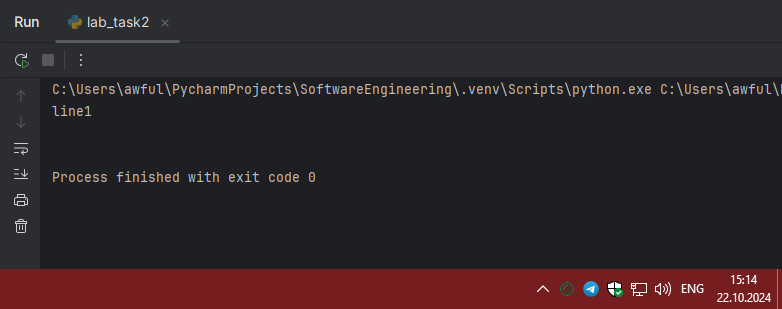

# Тема 6. Базовые коллекции: словари, кортежи
Отчет по Теме #6 выполнил(а):
- Артемов Артём Вячеславович
- ИВТ-22-1

| Задание | Лаб_раб | Сам_раб |
| ------ | ------ | ------ |
| Задание 1 | + | + |
| Задание 2 | + | + |
| Задание 3 | + | + |
| Задание 4 | + | + |
| Задание 5 | + | + |
| Задание 6 | - | - |
| Задание 7 | - | - |
| Задание 8 | - | - |
| Задание 9 | - | - |
| Задание 10 | - | - |

знак "+" - задание выполнено; знак "-" - задание не выполнено;

Работу проверили:
- к.э.н., доцент Панов М.А.

## Лабораторная работа №1
### В школе, где вы учились, узнали, что вы крутой программист и
### попросили написать программу для учителей, которая будет при вводе
### кабинета писать для него ключ доступа и статус, занят кабинет или нет.
### При написании программы необходимо использовать словарь (dict), который на вход получает номер кабинета, а выводит необходимую
### информацию. Если кабинета, который вы ввели нет в словаре, то в
### консоль в виде значения ключа нужно вывести “None” и виде статуса
### вывести “False”.
### По большому счету написав данную программу мы с вами научились
### заменять иногда громоздкую конструкцию if/elif/else. Поскольку здесь
### функционал словаря полностью повторяет функционал условия, но при
### этом у использования словарей в более сложных программах есть
### намного больше возможностей реализации.

```python
request = int(input('Введите номер кабинета: '))

dictionary = {
    101: {'key': 1234, 'access': True},
    102: {'key': 1337, 'access': True},
    103: {'key': 8943, 'access': True},
    104: {'key': 5555, 'access': False},
    None: {'key': None, 'access': False},
}

response = dictionary.get(request)

if not response:
    response = dictionary[None]
key = response.get('key')
access = response.get('access')
print(key, access)
```
### Результат.


### Выводы

В конечном итоге, разработав эту программу, мы научились заменять иногда сложные конструкции if/elif/else. Функциональность словаря полностью соответствует функциональности условных операторов, но при этом использование словарей в более сложных программах предоставляет гораздо больше возможностей для реализации.

## Лабораторная работа №2
### Алексей решил создать самый большой словарь в мире. Для этого он
### придумал функцию dict_maker (**kwargs), которая принимает
### неограниченное количество параметров «ключ: значение» и обновляет
### созданный им словарь my_dict, состоящий всего из одного элемента
### «first» со значением «so easy». Помогите Алексею создать данную
### функцию.
### Ниже на скриншоте мы использовали встроенный модуль pprint, который выводит большие объемы информации более понятно для
### восприятия человеческим глазом. Иногда очень удобно использовать
### данную возможность Python.

```python
from pprint import pprint

my_dict = {'first': 'so easy'}

def dict_maker(**kwargs):
    my_dict.update(**kwargs)

dict_maker(a1=1, a2=20, a3=54, a4=13)
dict_maker(name='Михаил', age=31, weight=70, eyes_color='blue')
pprint(my_dict)
```
### Результат.



### Выводы

Мы применяли встроенный модуль pprint, который представляет большие объемы информации в более удобочитаемом виде для человеческого восприятия. Иногда такая функция Python оказывается очень полезной.

## Лабораторная работа №3
### Для решения некоторых задач бывает необходимо разложить строку на
### отдельные символы. Мы знаем что это можно сделать при помощи
### split(), у которого более гибкая настройка для разделения для этого, но
### если нам нужно посимвольно разделить строку без всяких условий, то
### для этого мы можем использовать кортежи (tuple). Для этого напишем
### любую строку, которую будем делить и “обвернем” ее в tuple и дальше
### мы можем как нам угодно с ней работать, например, сделать ее
### списком (тогда получится полный аналог split()) или же работать с ним
### дальше, как с кортежем.

```python
input_string = 'HelloWorld'
result = tuple(input_string)
print(result)
print(list(result))
```
### Результат.


### Выводы

Мы можем использовать кортежи (tuple). Для этого напишем любую строку, которую собираемся разделить, и "обернем" её в кортеж. После этого мы можем работать с ней различными способами: например, превратить её в список (в этом случае получим полноценный аналог функции split()) или продолжить работать с ней как с кортежем.
  
## Лабораторная работа №4
### Вовочка решил написать крутую функцию, которая будет писать имя, возраст и место работы, но при этом на вход этой функции будет
### поступать кортеж. Помогите Вовочке написать эту программу.


```python
def personal_info(name, age, company='unnamed'):
    print(f"Имя: {name} Возраст: {age} Компания: {company}")
    
tom = ("Григорий", 22)
personal_info(*tom)

bob = ("Георгий", 41, "Yandex")
personal_info(*bob)
```
### Результат.


### Выводы

Указать имя, возраст и место работы, при этом в качестве входного параметра этой функции будет использоваться кортеж.

## Лабораторная работа №5
### Для сопровождения первых лиц государства X нужен кортеж, но никто
### не может определиться с порядком машин, поэтому вам нужно
### написать функцию, которая будет сортировать кортеж, состоящий из
### целых чисел по возрастанию, и возвращает его. Если хотя бы один
### элемент не является целым числом, то функция возвращает исходный
### кортеж.


```python
def tuple_sort(tpl):
    for elm in tpl:
        if not isinstance(elm, int):
            return tpl
    return tuple(sorted(tpl))

print(tuple_sort((5, 5, 3, 1, 9)))
print(tuple_sort((5, 5, 2.1, '1', 9)))
```
### Результат.


### Выводы

Создать функцию, которая сортирует кортеж, содержащий целые числа, в порядке возрастания и возвращает отсортированный кортеж. Если хотя бы один элемент не является целым числом, функция вернет исходный кортеж.

## Самостоятельная работа №1
### При создании сайта у вас возникла потребность обрабатывать
### данные пользователя в странной форме, а потом переводить их в
### нужные вам форматы. Вы хотите принимать от пользователя
### последовательность чисел, разделенных пробелом, а после
### переформатировать эти данные в список и кортеж. Реализуйте вашу
### задумку. Для получения начальных данных используйте input().
### Результатом программы будет выведенный список и кортеж из
### начальных данных.

```python
s = input()

my_list = s.split(" ")
my_dict = tuple(s.replace(" ", ""))

print(my_list)
print(my_dict)
```
### Результат.


### Выводы

С помощью `my_list = s.split(" ")` - разбиваем строку на слова, используя метод split для разделения по пробелам.
Затем `my_dict = tuple(s.replace(" ", ""))` удаляет все пробелы из строки и преобразуем её в кортеж.
  
## Самостоятельная работа №2
### Николай знает, что кортежи являются неизменяемыми, но он очень
### упрямый и всегда хочет доказать, что он прав. Студент решил
### создать функцию, которая будет удалять первое появление
### определенного элемента из кортежа по значению и возвращать
### кортеж без него. Попробуйте повторить шедевр не признающего
### авторитеты начинающего программиста. Но учтите, что Николай не
### всегда уверен в наличии элемента в кортеже (в этом случае кортеж
### вернется функцией в исходном виде).
### Входные данные:
### (1, 2, 3), 1)
### (1, 2, 3, 1, 2, 3, 4, 5, 2, 3, 4, 2, 4, 2), 3) (2, 4, 6, 6, 4, 2), 9)
### Ожидаемый результат:
### (2, 3)
### (1, 2, 1, 2, 3, 4, 5, 2, 3, 4, 2, 4, 2)
### (2, 4, 6, 6, 4, 2)

```python
def remove_element(tup, value):
    new_list = []

    for x in tup:
        if x != value:
            new_list.append(x)

    return tuple(new_list)


my_tuple = (1, 2, 3, 4, 5)
element_to_remove = 3

new_tuple = remove_element(my_tuple, element_to_remove)
print("Новый кортеж:", new_tuple)
```
### Результат.


### Выводы

1. `for x in tup:` проходимся по всем элементам списка
2. `new_list.append(x)` если элемент не равен заданному добавляем его в список
  
## Самостоятельная работа №3
### Ребята поспорили кто из них одним нажатием на numpad наберет
### больше повторяющихся цифр, но не понимают, как узнать
### победителя. Вам им нужно в этом помочь. Дана строка в виде
### случайной последовательности чисел от 0 до 9 (длина строки
### минимум 15 символов). Требуется создать словарь, который в
### качестве ключей будет принимать данные числа (т. е. ключи будут
### типом int), а в качестве значений – количество этих чисел в
### имеющейся последовательности. Для построения словаря создайте
### функцию, принимающую строку из цифр. Функция должна
### возвратить словарь из 3-х самых часто встречаемых чисел, также
### эти значения нужно вывести в порядке возрастания ключа.


```python
from collections import Counter


def most_frequent_digits(s):
    digit_count = Counter(int(digit) for digit in s)

    most_common_digits = digit_count.most_common(3)

    most_common_digits_sorted = sorted(most_common_digits)

    result_dict = {}

    for digit, count in most_common_digits_sorted:
        result_dict[digit] = count

    return result_dict


input_string = "1234567890123456789012345"
result = most_frequent_digits(input_string)

print("Три самых частых числа и их количество:", result)
```
### Результат.


### Выводы

1. `digit_count = Counter(int(digit) for digit in s)` считаем кол-во каждого символа
2. `most_common_digits = digit_count.most_common(3)` находим 3 самых часто встречающихся числа
3. `most_common_digits_sorted = sorted(most_common_digits)` сортируем по возрастанию чисел (ключей)
4. `for digit, count in most_common_digits_sorted:` добавляем в словарь отсортированные значения
  
## Самостоятельная работа №4
### Ваш хороший друг владеет офисом со входом по электронным
### картам, ему нужно чтобы вы написали программу, которая
### показывала в каком порядке сотрудники входили и выходили из
### офиса. Определение сотрудника происходит по id. Напишите
### функцию, которая на вход принимает кортеж и случайный элемент
### (id), его можно придумать самостоятельно. Требуется вернуть
### новый кортеж, начинающийся с первого появления элемента в нем и
### заканчивающийся вторым его появлением включительно.
### Если элемента нет вовсе – вернуть пустой кортеж.
### Если элемент встречается только один раз, то вернуть кортеж, который начинается с него и идет до конца исходного.
### Входные данные:
### (1, 2, 3), 8)
### (1, 8, 3, 4, 8, 8, 9, 2), 8)
### (1, 2, 8, 5, 1, 2, 9), 8)
### Ожидаемый результат:
### ()
### (8, 3, 4, 8)
### (8, 5, 1, 2, 9)

```python
def extract_subtuple(tup, element):
    if element not in tup:
        return () 

    first_index = tup.index(element)

    try:
        second_index = tup.index(element, first_index + 1)
        return tup[first_index:second_index + 1]
    except ValueError:
        return tup[first_index:]

my_tuple = (1, 2, 3, 4, 5, 3, 6, 7, 3, 8, 9)
element_to_find = 3

result = extract_subtuple(my_tuple, element_to_find)
print("Результат:", result)
```
### Результат.


### Выводы

1. `if element not in tup:` проверяем, есть ли элемент в кортеже
2. `first_index = tup.index(element)` находим первое появление элемента
3. `second_index = tup.index(element, first_index + 1)` ищем второе появление элемента после первого
4. `return tup[first_index:second_index + 1]` возвращаем кортеж от первого до второго появления элемента
5. `return tup[first_index:]` если второго появления нет, возвращаем кортеж от первого появления до конца
  
## Самостоятельная работа №5
### Самостоятельно придумайте и решите задачу, в которой будут
### обязательно использоваться кортеж или список. Проведите
### минимум три теста для проверки работоспособности вашей задачи.

Условие:  напишите функцию, которая принимает на вход список чисел, удаляет все дубликаты, сортирует числа по возрастанию и возвращает кортеж из уникальных отсортированных элементов.  

```python
def process_list(numbers):
    unique_numbers = list(set(numbers))  # Удаляем дубликаты, преобразуя список во множество, затем обратно в список
    unique_numbers.sort()  # Сортируем список
    return tuple(unique_numbers)  # Преобразуем результат в кортеж

# Тест 1: Список с дубликатами и разными числами
test1 = [5, 3, 8, 3, 1, 5, 9, 2]
result1 = process_list(test1)
print(result1)  # Ожидаемый результат: (1, 2, 3, 5, 8, 9)

# Тест 2: Список с одинаковыми элементами
test2 = [4, 4, 4, 4]
result2 = process_list(test2)
print(result2)  # Ожидаемый результат: (4,)

# Тест 3: Список с отрицательными числами
test3 = [-1, -5, -3, -5, 0, 2, -1]
result3 = process_list(test3)
print(result3)  # Ожидаемый результат: (-5, -3, -1, 0, 2)

```

### Результат.


### Выводы

1. Используем множество для удаления дубликатов, так как в множестве не может быть одинаковых элементов.
2. Затем результат сортируется с использованием метода sort().
3. Результат возвращается в виде кортежа, так как кортежи неизменяемы, что может быть полезно для хранения данных, которые не должны изменяться.

## Общие выводы по теме
Я освоил основные принципы работы со словарями и кортежами на базовом уровне. В частности, я получил общее представление о том, как они функционируют в языке Python, включая их создание, доступ к элементам и методы, которые можно применять к ним.