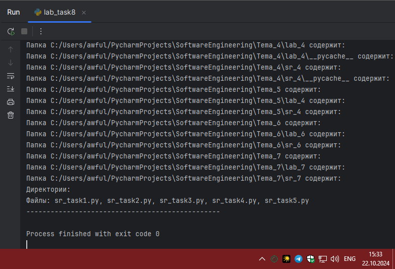
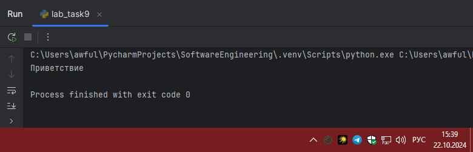
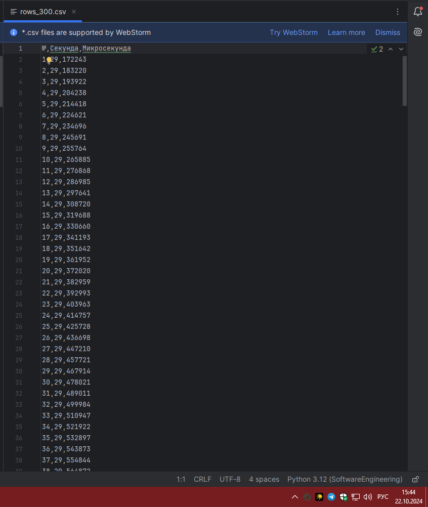
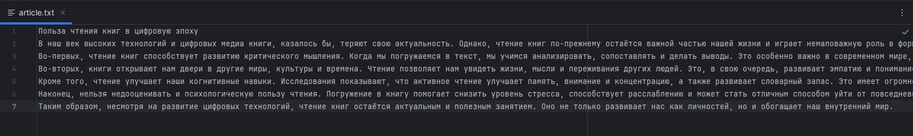
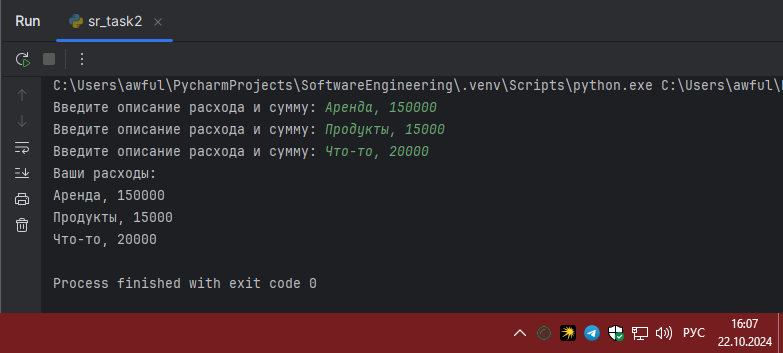
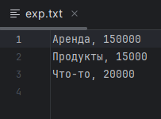

# Тема 7. Работа с файлами (ввод и вывод)
Отчет по Теме #7 выполнил:
- Артемов Артём Вячеславович
- ИВТ-22-1

| Задание    | Лаб_раб | Сам_раб |
|------------|---------|---------|
| Задание 1  | +       | +       |
| Задание 2  | +       | +       |
| Задание 3  | +       | +       |
| Задание 4  | +       | +       |
| Задание 5  | +       | +       |
| Задание 6  | +       | -       |
| Задание 7  | +       | -       |
| Задание 8  | +       | -       |
| Задание 9  | +       | -       |
| Задание 10 | +       | -       |

знак "+" - задание выполнено; знак "-" - задание не выполнено;

Работу проверили:
- к.э.н., доцент Панов М.А.

## Лабораторная работа №1
### Составьте текстовый файл и положите его в одну директорию с
### программой на Python. Текстовый файл должен состоять минимум из
### двух строк.

```python

```
### Результат.


### Выводы

Создан текстовой файл в директории с программой

## Лабораторная работа №2
### Напишите программу, которая выведет только первую строку из
### вашего файла, при этом используйте конструкцию open()/close().

```python
f = open('lab_task1.txt', 'r')
print(f.readline())
f.close()
```
### Результат.


### Выводы

Вывели первую строку и текстового файла

## Лабораторная работа №3
### Напишите программу, которая выведет все строки из вашего файла в
### массиве, при этом используйте конструкцию open()/close().

```python
f = open('lab_task1.txt', 'r')
print(f.readlines())
f.close()
```
### Результат.


### Выводы

Вывели все строки из текстового файла
  
## Лабораторная работа №4
### Напишите программу, которая выведет все строки из вашего файла в
### массиве, при этом используйте конструкцию with open().


```python
with open('lab_task1.txt') as f:
    print(f.readlines())
```
### Результат.


### Выводы

С помощью `with open('input.txt') as f:` вывели все строки текстового файла

## Лабораторная работа №5
### Напишите программу, которая выведет каждую строку из вашего
### файла отдельно, при этом используйте конструкцию with open().


```python
with open('lab_task1.txt') as f:
    for line in f:
        print(line)
```
### Результат.


### Выводы

С помощью цикла вывели каждую строку текстового файла

## Лабораторная работа №6
### Напишите программу, которая будет добавлять новую строку в ваш
### файл, а потом выведет полученный файл в консоль. Вывод можно
### осуществлять любым способом. Обязательно проверьте сам файл, чтобы изменения в нем тоже отображались.


```python
with open('lab_task1.txt', 'a+') as f:
    f.write('\nIm additional line')

with open('lab_task1.txt', 'r') as f:
    result = f.readlines()
    print(result)
```
### Результат.


### Выводы

`with open('input.txt', 'a+') as f:` добавить в файл
`with open('input.txt', 'r') as f:` чтение из файла

## Лабораторная работа №7
### Напишите программу, которая перепишет всю информацию, которая
### была у вас в файле до этого, например напишет любые данные из
### произвольно вами составленного списка. Также не забудьте проверить
### что измененная вами информация сохранилась в файле.


```python
lines = ['first', 'second', 'third']
with open('lab_task1.txt', 'w') as f:
    for line in lines:
        f.write('\nCycle run ' + line)
    print('Done!')
```
### Результат.


### Выводы

`with open('input.txt', 'w') as f:` перезапись файла

## Лабораторная работа №8
### Выберите любую папку на своем компьютере, имеющую вложенные
### директории. Выведите на печать в терминал ее содержимое, как и всех
### подкаталогов при помощи функции print_docs(directory).


```python
import os

def print_docs(directory):
    all_files = os.walk(directory)
    for catalog in all_files:
        print(f'Папка {catalog[0]} содержит:')
    print(f'Директории: {", ".join([folder for folder in catalog[1]])}')
    print(f'Файлы: {", ".join([file for file in catalog[2]])}')
    print('-' * 48)

print_docs('C:/Users/awful/PycharmProjects')
```
### Результат.



### Выводы

`os` позволяет пройтись по директориям

## Лабораторная работа №9
### Документ «input.txt» содержит следующий текст: Приветствие
### Спасибо
### Извините
### Пожалуйста
### До свидания
### Ты готов?
### Как дела?
### С днем рождения!
### Удача!
### Я тебя люблю.
### Требуется реализовать функцию, которая выводит слово, имеющее
### максимальную длину (или список слов, если таковых несколько).
### Проверьте работоспособность программы на своем наборе данных


```python
def longest_words(file):
    with open(file, encoding='utf-8') as f:
        words = f.read().split()
        max_length = len(max(words, key=len))
        for word in words:
            if len(word) == max_length:
                sought_words = word

        if len(sought_words) == 1:
            return sought_words[0]
        return sought_words

print(longest_words('lab_task1.txt'))
```
### Результат.



### Выводы

Из текстового файла вывели слово, имеющее максимальную длину

## Лабораторная работа №10
### Требуется создать csv-файл «rows_300.csv» со следующими
### столбцами:
### • № - номер по порядку (от 1 до 300);
### • Секунда – текущая секунда на вашем ПК;
### • Микросекунда – текущая миллисекунда на часах.
### Для наглядности на каждой итерации цикла искусственно
### приостанавливайте скрипт на 0,01 секунды.


```python
import csv
import datetime
import time

with open('rows_300.csv', 'w', encoding='utf-8', newline='') as f:
    writer = csv.writer(f)
    writer.writerow(['№', 'Секунда', 'Микросекунда'])
    for line in range(1, 301):
        writer.writerow([line, datetime.datetime.now().second,
                         datetime.datetime.now().microsecond])
        time.sleep(0.01)
```
### Результат.



### Выводы

Создали файл файл «rows_300.csv»

## Самостоятельная работа №1
### Найдите в интернете любую статью (объем статьи не менее 200
### слов), скопируйте ее содержимое в файл и напишите программу, которая считает количество слов в текстовом файле и определит
### самое часто встречающееся слово. Результатом выполнения задачи
### будет: скриншот файла со статьей, листинг кода, и вывод в консоль, в котором будет указана вся необходимая информация.

```python
from collections import Counter
import re

def count_words_in_file(filename):
    with open(filename, 'r', encoding='utf-8') as file:
        text = file.read().lower()
        words = re.findall(r'\b\w+\b', text)
        word_count = Counter(words)
        most_common_word = word_count.most_common(1)[0]
    return len(words), most_common_word

total_words, most_common_word = count_words_in_file("article.txt")
print(f"Общее количество слов: {total_words}")
print(f"Самое частое слово: '{most_common_word[0]}', количество вхождений: {most_common_word[1]}")
```
### Результат.




### Выводы

1. `text = file.read().lower()` Читаем файл и приводим текст к нижнему регистру
2. `words = re.findall(r'\b\w+\b', text)` Используем регулярное выражение для поиска слов
3. `word_count = Counter(words)` Подсчитываем количество вхождений каждого слова
4. `most_common_word = word_count.most_common(1)[0]` Находим самое частое слово
  
## Самостоятельная работа №2
### У вас появилась потребность в ведении книги расходов, посмотрев
### все существующие варианты вы пришли к выводу что вас ничего не
### устраивает и нужно все делать самому. Напишите программу для
### учета расходов. Программа должна позволять вводить информацию
### о расходах, сохранять ее в файл и выводить существующие данные в
### консоль. Ввод информации происходит через консоль. Результатом
### выполнения задачи будет: скриншот файла с учетом расходов, листинг кода, и вывод в консоль, с демонстрацией
### работоспособности программы.

```python
def add_expense(filename):
    with open(filename, 'a', encoding='utf-8') as file:
        expense = input("Введите описание расхода и сумму: ")
        file.write(expense + "\n")

def show_expenses(filename):
    with open(filename, 'r', encoding='utf-8') as file:
        expenses = file.readlines()
        if expenses:
            print("Ваши расходы:")
            for expense in expenses:
                print(expense.strip())
        else:
            print("Расходов нет.")

add_expense("exp.txt")
add_expense("exp.txt")
add_expense("exp.txt")
show_expenses("exp.txt")
```
### Результат.




### Выводы

1. `file.write(expense + "\n")` Записываем строку в файл
2. `print(expense.strip())` Выводим каждую строку
  
## Самостоятельная работа №3
### Имеется файл input.txt с текстом на латинице. Напишите программу, которая выводит следующую статистику по тексту: количество букв
### латинского алфавита; число слов; число строк.
### • Текст в файле:
### Beautiful is better than ugly.
### Explicit is better than implicit.
### Simple is better than complex.
### Complex is better than complicated.
### • Ожидаемый результат:
### Input file contains:
### 108 letters
### 20 words
### 4 lines


```python
import re

def text_statistics(filename):
    with open(filename, 'r', encoding='utf-8') as file:
        lines = file.readlines()
        num_lines = len(lines)
        num_words = 0
        num_letters = 0

        for line in lines:
            words = line.split()
            num_words += len(words)
            num_letters += len(re.findall(r'[a-zA-Z]', line))

        print(f"Количество букв латинского алфавита: {num_letters}")
        print(f"Количество слов: {num_words}")
        print(f"Количество строк: {num_lines}")

text_statistics("input.txt")
```
### Результат.


### Выводы

1. `lines = file.readlines()` Читаем все строки файла
2. `words = line.split()` Разбиваем строку на слова
3. `num_words += len(words)` Считаем слова
4. `num_letters += len(re.findall(r'[a-zA-Z]', line))` Используем регулярное выражение для поиска латинских букв
  
## Самостоятельная работа №4
### Напишите программу, которая получает на вход предложение, выводит его в терминал, заменяя все запрещенные слова
### звездочками * (количество звездочек равно количеству букв в
### слове). Запрещенные слова, разделенные символом пробела, хранятся в текстовом файле input.txt. Все слова в этом файле
### записаны в нижнем регистре. Программа должна заменить
### запрещенные слова, где бы они ни встречались, даже в середине
### другого слова. Замена производится независимо от регистра: если
### файл input.txt содержит запрещенное слово exam, то слова exam, Exam, ExaM, EXAM и exAm должны быть заменены на ****.
### • Запрещенные слова:
### hello email python the exam wor is
### • Предложение для проверки:
### Hello, world! Python IS the programming language of thE future. My EMAIL is....
### PYTHON is awesome!!!!
### • Ожидаемый результат:
### *****, ***ld! ****** ** *** programming language of *** future. My
### ***** **....
### ****** ** awesome!!!!


```python
import re

def load_forbidden_words(filename):
    with open(filename, 'r', encoding='utf-8') as file:
        forbidden_words = file.read().split()
    return forbidden_words

def censor_sentence(sentence, forbidden_words):
    for word in forbidden_words:
        pattern = re.compile(re.escape(word), re.IGNORECASE)
        sentence = pattern.sub('*' * len(word), sentence)
    return sentence

forbidden_words = load_forbidden_words("input1.txt")

sentence = input("Введите предложение для проверки: ")

censored_sentence = censor_sentence(sentence, forbidden_words)

print("Результат:", censored_sentence)
```
### Результат.


### Выводы

1. `forbidden_words = file.read().split()` Чтение и разбиение строки на слова
2. `pattern = re.compile(re.escape(word), re.IGNORECASE)` Создаем регулярное выражение для поиска запрещенных слов независимо от регистра
3. `sentence = pattern.sub('*' * len(word), sentence)` Замена на звездочки
4. `forbidden_words = load_forbidden_words("input.txt")` Чтение списка запрещённых слов из файла
  
## Самостоятельная работа №5
### Самостоятельно придумайте и решите задачу, которая будет
### взаимодействовать с текстовым файлом.

Написать программу на языке Python, которая будет читать список имен из текстового файла "names.txt" и выводить их на экран. Если файл не существует, программа должна сообщить об этом.

```python
def read_file(file_path):
    try:
        with open(file_path, 'r', encoding='utf-8') as file:
            names = file.readlines()
        print("Имена из файла:")
        for name in names:
            print(name.strip())
    except FileNotFoundError:
        print(f"Файл '{file_path}' не найден.")

def main():
    file_path = 'names.txt'
    read_file(file_path)

if __name__ == '__main__':
    main()
```

### Результат.


### Выводы

1. Функция `read_file`: Открывает файл "names.txt" для чтения. Если файл существует, она считывает имена и выводит их на экран. Если файл не найден, выводится сообщение об ошибке.
2. Функция `main`: Стартовая точка программы, где вызывается функция `read_file`.

## Общие выводы по теме
Освоили работу с файлами (ввод и вывод) в Python
