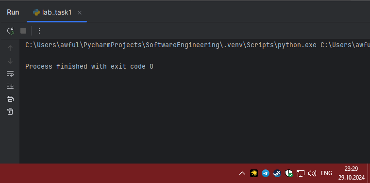
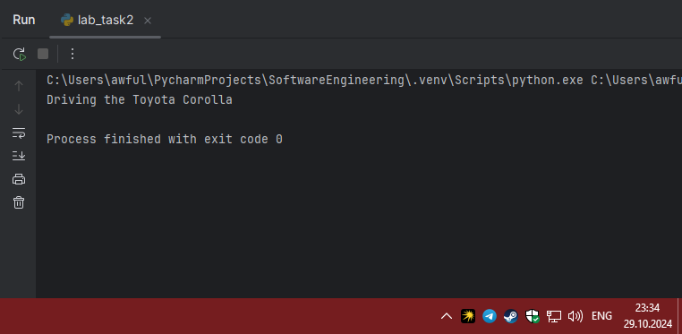
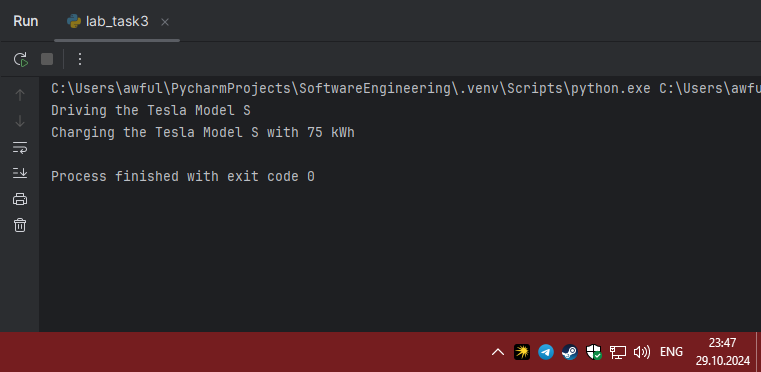
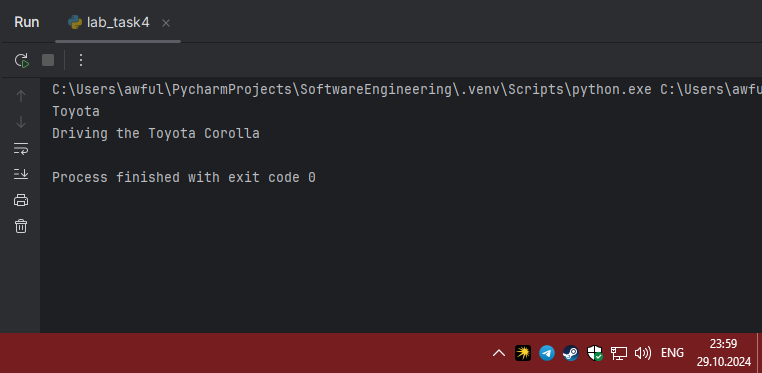
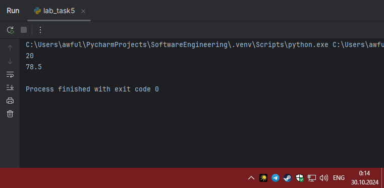
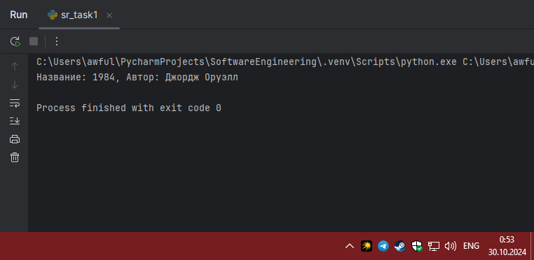
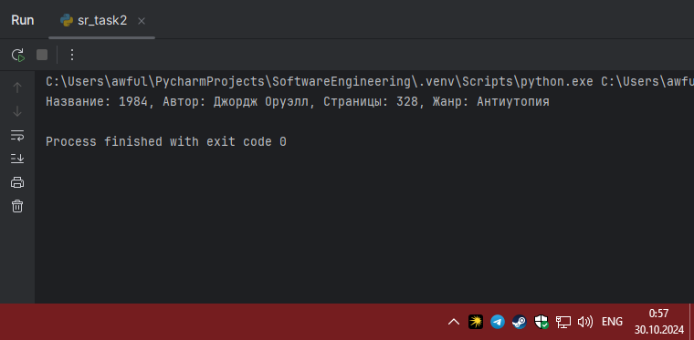
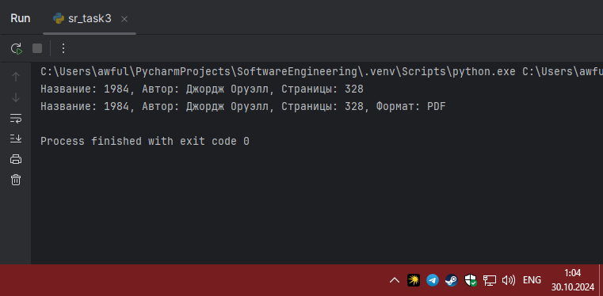
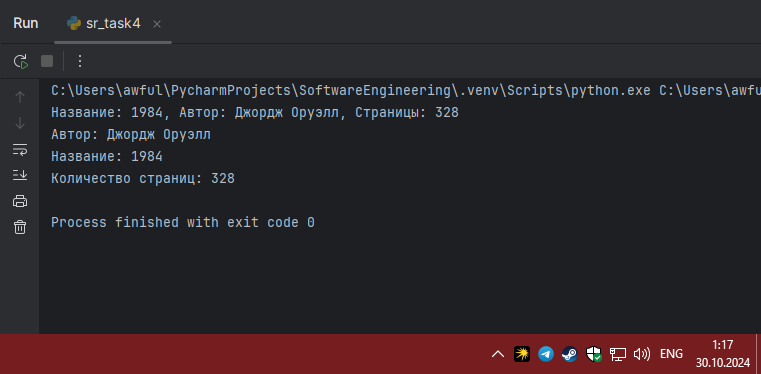
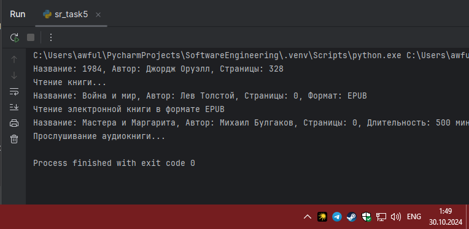

# Тема 8. Основы объектно-ориентированного программирования
Отчет по Теме #8 выполнил:
- Артемов Артём Вячеславович
- ИВТ-22-1

| Задание    | Лаб_раб | Сам_раб |
|------------|---------|---------|
| Задание 1  | +       | +       |
| Задание 2  | +       | +       |
| Задание 3  | +       | +       |
| Задание 4  | +       | +       |
| Задание 5  | +       | +       |
| Задание 6  | -       | -       |
| Задание 7  | -       | -       |
| Задание 8  | -       | -       |
| Задание 9  | -       | -       |
| Задание 10 | -       | -       |

знак "+" - задание выполнено; знак "-" - задание не выполнено;

Работу проверили:
- к.э.н., доцент Панов М.А.

## Лабораторная работа №1
### Создайте класс “Car” с атрибутами производитель и модель. Создайте
### объект этого класса. Напишите комментарии для кода, объясняющие
### его работу. Результатом выполнения задания будет листинг кода с
### комментариями.

```python
class Car:
    def __init__(self, make, model):
        self.make = make
        self.model = model

my_car = Car("Toyota", "Corolla")
```
### Результат.



### Выводы

Был создан класс `Car`, который моделирует объект автомобиля

## Лабораторная работа №2
### Дополните код из первого задания, добавив в него атрибуты и методы
### класса, заставьте машину “поехать”. Напишите комментарии для кода, объясняющие его работу. Результатом выполнения задания будет
### листинг кода с комментариями и получившийся вывод в консоль.

```python
class Car:
    def __init__(self, make, model):
        self.make = make
        self.model = model

    def drive(self):
        # Выводит сообщение о том, что автомобиль едет
        print(f"Driving the {self.make} {self.model}")


# Создается объект my_car с маркой "Toyota" и моделью "Corolla"
my_car = Car("Toyota", "Corolla")


#Сообщение о том, что автомобиль едет
my_car.drive()
```
### Результат.



### Выводы

Был расширен код класса `Car`, добавив новые атрибуты и методы, которые имитируют движение автомобиля

## Лабораторная работа №3
### Создайте новый класс “ElectricCar” с методом “charge” и атрибутом
### емкость батареи. Реализуйте его наследование от класса, созданного в
### первом задании. Заставьте машину поехать, а потом заряжаться.
### Результатом выполнения задания будет листинг кода с комментариями
### и получившийся вывод в консоль.

```python
class Car:
    def __init__(self, make, model):

        self.make = make
        self.model = model

    def drive(self):
        print(f"Driving the {self.make} {self.model}")

# Создаем новый класс ElectricCar, который наследует класс Car
class ElectricCar(Car):  
    def __init__(self, make, model, battery_capacity):
        super().__init__(make, model)  # инициализирует атрибуты родительского класса
        self.battery_capacity = battery_capacity  # устанавливает емкость батареи

    def charge(self):
        # Выводит сообщение о том, что электромобиль заряжается
        print(f"Charging the {self.make} {self.model} with {self.battery_capacity} kWh")


# Создается объект my_electric_car с маркой "Tesla", моделью "Model S" и емкостью батареи 75 кВт-ч
my_electric_car = ElectricCar("Tesla", "Model S", 75)


# Этот метод выведет сообщение о том, что электромобиль едет
my_electric_car.drive()


# Этот метод выведет сообщение о процессе зарядки электромобиля
my_electric_car.charge()
```
### Результат.



### Выводы

Создан новый класс `ElectricCar`, наследующий свойства и методы от класса `Car`
  
## Лабораторная работа №4
### Реализуйте инкапсуляцию для класса, созданного в первом задании.
### Создайте защищенный атрибут производителя и приватный атрибут
### модели. Вызовите защищенный атрибут и заставьте машину поехать.
### Напишите комментарии для кода, объясняющие его работу.
### Результатом выполнения задания будет листинг кода с комментариями
### и получившийся вывод в консоль.


```python
class Car:
    def __init__(self, make, model):
        self._make = make  # устанавливает марку автомобиля (защищенный)
        self.__model = model  # устанавливает модель автомобиля (частный)

    def drive(self):
        print(f"Driving the {self._make} {self.__model}")

my_car = Car("Toyota", "Corolla")

# Вывод защищенного атрибута _make
# Доступ к этому атрибуту возможен, так как он является защищенным
print(my_car._make)

my_car.drive()
```
### Результат.



### Выводы

Реализована инкапсуляция для класса `Car`

## Лабораторная работа №5
### Реализуйте полиморфизм создав основной (общий) класс “Shape”, а
### также еще два класса “Rectangle” и “Circle”. Внутри последних двух
### классов реализуйте методы для подсчета площади фигуры. После этого
### создайте массив с фигурами, поместите туда круг и прямоугольник, затем при помощи цикла выведите их площади. Напишите
### комментарии для кода, объясняющие его работу. Результатом
### выполнения задания будет листинг кода с комментариями и
### получившийся вывод в консоль.


```python
class Shape:
    def area(self):
        # Метод для вычисления площади
        # Нужно переопределить в дочерних классах
        pass

# Класс Rectangle наследует от класса Shape
class Rectangle(Shape):
    def __init__(self, width, height):
        self.width = width  # устанавливает ширину прямоугольника
        self.height = height  # устанавливает высоту прямоугольника

    def area(self):
        # Метод для вычисления площади прямоугольника
        # Площадь рассчитывается как ширина * высота
        return self.width * self.height

# Класс Circle также наследует от класса Shape
class Circle(Shape):
    def __init__(self, radius):
        self.radius = radius  # устанавливает радиус круга

    def area(self):
        # Метод для вычисления площади круга
        # Площадь рассчитывается как π * радиус²
        return 3.14 * self.radius * self.radius

# Создается объект my_rectangle с шириной 5 и высотой 4
my_rectangle = Rectangle(5, 4)

# Создается объект my_circle с радиусом 5
my_circle = Circle(5)

# Вывод площади прямоугольника
# Вызов метода area для my_rectangle, который вернет 20 (5 * 4)
print(my_rectangle.area())

# Вывод площади круга
# Вызов метода area для my_circle, который вернет 78.5 (3.14 * 5 * 5)
print(my_circle.area())
```
### Результат.



### Выводы

Реализован полиморфизм путем создания общего класса `Shape`, а также двух производных классов — `Rectangle` и `Circle`. В каждом из этих классов были добавлены методы для вычисления площади фигуры.

## Самостоятельная работа №1
### Самостоятельно создайте класс и его объект. Они должны
### отличаться, от тех, что указаны в теоретическом материале
### (методичке) и лабораторных заданиях. Результатом выполнения
### задания будет листинг кода и получившийся вывод консоли.

```python
class Book:
    def __init__(self, title, author):
        self.title = title
        self.author = author

    def display_info(self):
        return f"Название: {self.title}, Автор: {self.author}"

my_book = Book("1984", "Джордж Оруэлл")

print(my_book.display_info())
```
### Результат.



### Выводы

Класс `Book` для представления книги, который содержит свойства такие как название и автор 
  
## Самостоятельная работа №2
### Самостоятельно создайте атрибуты и методы для ранее созданного
### класса. Они должны отличаться, от тех, что указаны в
### теоретическом материале (методичке) и лабораторных заданиях.
### Результатом выполнения задания будет листинг кода и
### получившийся вывод консоли.

```python
class Book:
    def __init__(self, title, author, genre):
        self.title = title
        self.author = author
        self.pages = 0
        self.genre = genre

    def display_info(self):
        return f"Название: {self.title}, Автор: {self.author}, Страницы: {self.pages}, Жанр: {self.genre}"

    def set_pages(self, pages):
        self.pages = pages

my_book = Book("1984", "Джордж Оруэлл", "Антиутопия")

my_book.set_pages(328)

print(my_book.display_info())
```
### Результат.



### Выводы

Добавил атрибут `genre` (жанр книги) и метод для изменения количества страниц, а также метод для отображения всех атрибутов.
  
## Самостоятельная работа №3
### Самостоятельно реализуйте наследование, продолжая работать с
### ранее созданным классом. Оно должно отличаться, от того, что
### указано в теоретическом материале (методичке) и лабораторных
### заданиях. Результатом выполнения задания будет листинг кода и
### получившийся вывод консоли.


```python
class Book:
    def __init__(self, title, author):
        self.title = title
        self.author = author
        self.pages = 0

    def set_pages(self, pages):
        self.pages = pages

    def display_info(self):
        return f"Название: {self.title}, Автор: {self.author}, Страницы: {self.pages}"

class EBook(Book):
    def __init__(self, title, author, file_format):
        super().__init__(title, author)
        self.file_format = file_format

    def display_info(self):
        return super().display_info() + f", Формат: {self.file_format}"

my_book = Book("1984", "Джордж Оруэлл")
my_book.set_pages(328)

my_ebook = EBook("1984", "Джордж Оруэлл", "PDF")
my_ebook.set_pages(328)

print(my_book.display_info())
print(my_ebook.display_info())
```
### Результат.



### Выводы

Создал наследник для класса `Book` с названием `EBook`, который будет представлять электронные книги. В этом классе есть атрибут для хранения формата файла (например PDF) и метод для отображения информации о формате.
  
## Самостоятельная работа №4
### Самостоятельно реализуйте инкапсуляцию, продолжая работать с
### ранее созданным классом. Она должна отличаться, от того, что
### указана в теоретическом материале (методичке) и лабораторных
### заданиях. Результатом выполнения задания будет листинг кода и
### получившийся вывод консоли.


```python
class Book:
    def __init__(self, title, author):
        self._title = title
        self._author = author
        self._pages = 0

    def set_pages(self, pages):
        if pages >= 0:
            self._pages = pages
        else:
            print("Количество страниц не может быть отрицательным.")

    def get_title(self):
        return self._title

    def get_author(self):
        return self._author

    def get_pages(self):
        return self._pages

    def display_info(self):
        return f"Название: {self._title}, Автор: {self._author}, Страницы: {self._pages}"

my_book = Book("1984", "Джордж Оруэлл")
my_book.set_pages(328)

print(my_book.display_info())
print(f"Автор: {my_book.get_author()}")
print(f"Название: {my_book.get_title()}")
print(f"Количество страниц: {my_book.get_pages()}")
```
### Результат.



### Выводы

Сделал атрибуты `title`, `author` и `pages` защищёнными, чтобы они могли быть доступны только через методы класса. Также добавил методы для получения и установки значений этих атрибутов.
  
## Самостоятельная работа №5
### Самостоятельно реализуйте полиморфизм. Он должен отличаться, от того, что указан в теоретическом материале (методичке) и
### лабораторных заданиях. Результатом выполнения задания будет
### листинг кода и получившийся вывод консоли.

```python
class Book:
    def __init__(self, title, author):
        self._title = title
        self._author = author
        self._pages = 0

    def set_pages(self, pages):
        if pages >= 0:
            self._pages = pages
        else:
            print("Количество страниц не может быть отрицательным.")

    def display_info(self):
        return f"Название: {self._title}, Автор: {self._author}, Страницы: {self._pages}"

    def play(self):
        return "Чтение книги..."


class EBook(Book):
    def __init__(self, title, author, file_format):
        super().__init__(title, author)
        self.file_format = file_format

    def display_info(self):
        return super().display_info() + f", Формат: {self.file_format}"

    def play(self):
        return "Чтение электронной книги в формате " + self.file_format


class AudioBook(Book):
    def __init__(self, title, author, duration):
        super().__init__(title, author)
        self.duration = duration

    def display_info(self):
        return super().display_info() + f", Длительность: {self.duration} минут"

    def play(self):
        return "Прослушивание аудиокниги..."


# Список книг разных типов
books = [
    Book("1984", "Джордж Оруэлл"),
    EBook("Война и мир", "Лев Толстой", "EPUB"),
    AudioBook("Мастера и Маргарита", "Михаил Булгаков", 500)
]

books[0].set_pages(328)

for book in books:
    print(book.display_info())
    print(book.play())
```

### Результат.



### Выводы

Реализовал полиморфизм в классе `Book` и его наследнике `EBook`, добавил еще один класс `AudioBook`, который будет представлять аудиокниги. В каждом из этих классов определил метод `play`, который будет делать что-то своеобразное для каждого типа книги.

## Общие выводы по теме
В ходе выполнения заданий рассмотрели основные принципы ООП, включая наследование, инкапсуляцию и полиморфизм. 